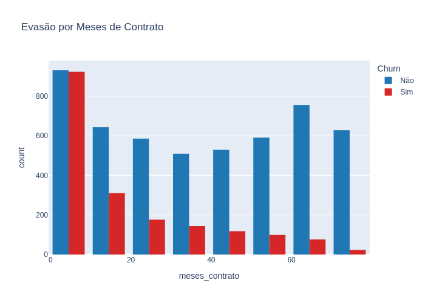
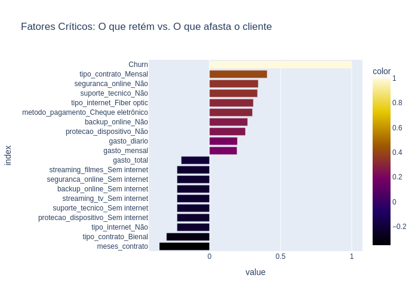

# Telecom X - Challenge 2 Data Science ONE G9

   

## Visão geral do projeto
Este projeto de Data Science foi desenvolvido para analisar a base de dados da **Telecom X** e enfrentar o desafio do **Churn (Evasão de clientes)**. Através de uma análise exploratória rigorosa (EDA), identificamos os perfis de clientes com maior propensão ao cancelamento e propusemos estratégias baseadas em dados para aumentar a retenção e a lucratividade da empresa.

## Stack tecnológica
- **Python & Pandas**: Limpeza de dados JSON, tradução de variáveis, tratamento de nulos e criação de métricas personalizadas (Gasto Diário).
- **Plotly Express**: Geração de histogramas e boxplots interativos para identificação de padrões de comportamento.
- **Scikit-learn & Encoding**: Transformação de variáveis categóricas em numéricas para análise de correlação.

## Resultados e Insights Estratégicos
A análise revelou padrões nítidos ligados ao tempo de contrato e ao tipo de serviço. O insight principal aponta que o **vencimento mensal** e a **falta de serviços de suporte** são os maiores gatilhos para a saída precoce do cliente.

### 1. Tendência de evasão por tempo de contrato
Identificamos que o maior volume de cancelamentos ocorre nos primeiros **6 meses** de contrato, indicando uma falha crítica na retenção de novos clientes.

  

### 2. Fatores críticos de influência (correlação)
Abaixo, a correlação matemática mostra os fatores que mais "influenciam" o cliente para cancelar o plano. O **Contrato Mensal** lidera a lista, enquanto serviços de segurança e suporte atuam como âncoras de fidelização.

  

## Recomendação Estratégica
Com base nos achados, as seguintes ações são recomendadas para reduzir o Churn:

- **Retenção no Onboarding:** Implementar descontos progressivos ou o primeiro mês gratuito para contratos mensais, focando em manter o cliente ativo além do 6º mês crítico.
- **Upsell de Proteção:** Oferecer combos que incluam "Segurança Online" e "Suporte Técnico" como benefícios nativos, aumentando o valor percebido e dificultando a migração para a concorrência.
- **Incentivo à Fidelidade:** Criar campanhas de migração do plano Mensal para o Anual através de bônus de dados ou upgrades de serviço, reduzindo a volatilidade da base.

## Como explorar a análise
1. Clone este repositório.
2. Abra o arquivo `Challenge2_dataScience_TelecomX.ipynb` no [Google Colab](https://colab.research.google.com/).
3. O notebook consome os dados automaticamente via URL da API.
4. Execute as células para acompanhar a linha de raciocínio e o relatório executivo integrado.

---
> *Transparência e vibe coding: A análise de dados, lógica de programação e tomada de decisão estratégica apresentadas neste repositório são de minha autoria. Porém, a redação e formatação estrutural deste README e do relatório final, bem como o suporte técnico para resolução de erros de visualização e otimização do relatório final de EDA, foram realizados com auxílio de IA (Gemini), focando em agilidade e entrega profissional.*
